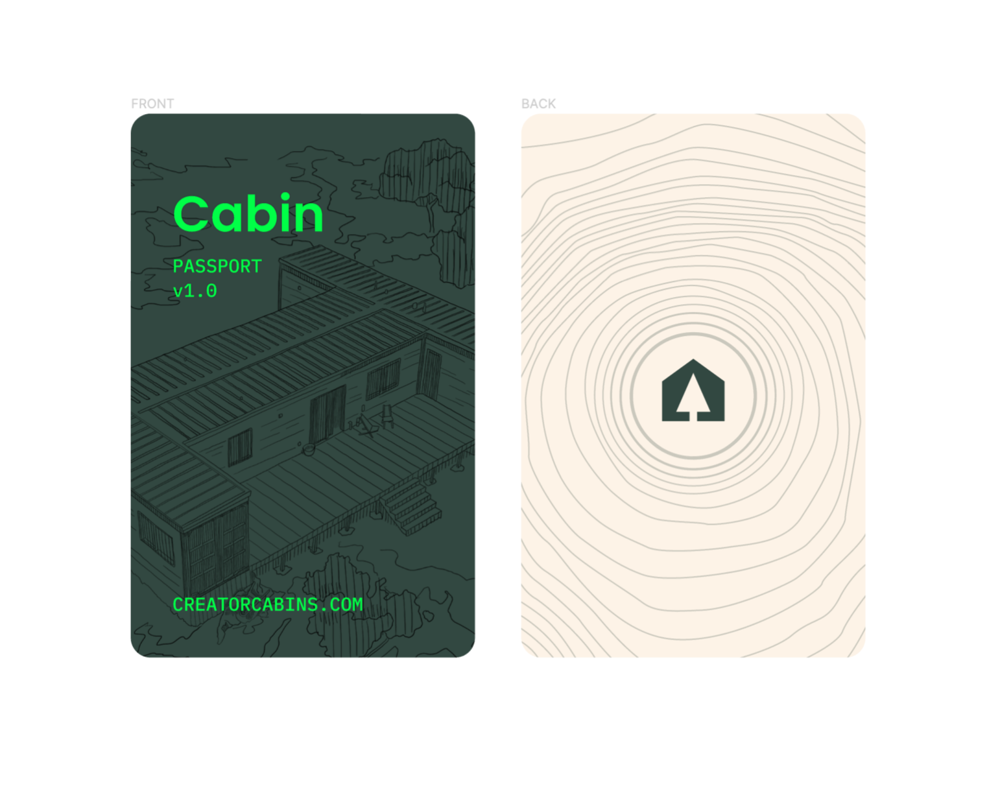

  

 

# Passports XYZ

## Quick Links

- [🎤 Staging Environment](https://passports-app.vercel.app/)
- [🙋 Start contributing](#Contributing)
- [🎯 View Bounties](https://app.clarity.so/cabin/view/3039c279-2ee2-4da2-a604-dc1c23d5010c)
- [🐞 Report a Bug](https://github.com/CabinDAO/Passports/issues/new)
- [❓ Ask a question](https://github.com/CabinDAO/Passports/discussions)

## Background: Why NFTs for Membership?

Every community in the Web3 space has it's own way of implementing membership.
Social DAOs like FWB use a fungible token (ERC-20) to token-gate their community
while NFT projects like Bored Ape Yacht Club do so with their ERC-721,
non-fungible token. As we outlined in our article, _[Unbundling social token
economics, governance, and
access](https://creators.mirror.xyz/V7Ucba89-3qV9yFxj7Spj7YxjKAhc6TOd8nUcCp9n6k)_,
we believe that every DAO and Web 3 community needs to decide how fungible their
membership is and make the appropriate technical decision to implement it as an
ERC-20 or an ERC-721.

There are plenty of tools for implementing membership and token-gating based on
an ERC-20, but very few (if any) for doing so with an ERC-721. The goal of
Passports.xyz is to provide a tool for easily minting NFTs that can be used for
this kind of token-gating.

## Contributing

CabinDAO operates under a Bounty system for its products, including Passports. Each Bounty is specced as a task in Clarity, which you could view the full board of tasks [here](https://app.clarity.so/cabin/view/3039c279-2ee2-4da2-a604-dc1c23d5010c). On each task, you could comment to ask questions to gain more context on what needs to be done. Once you understand a task well enough and are interested, you could begin tackling the task.

1. Assign yourself to the task on Clarity and mark the task as "In Progress".
1. Make changes locally to a new branch
1. Push and create a pull request against the main repo
1. Tag the relevant maintainers for review
1. Once approved, merge your pull request and delete the branch

In the ethos Web3, this project operates on permissionless contribution. Please read through this README to get setup and start contributing. If only after reading through this documentation that you are hitting roadblocks, feel free to DM @dvargas92495 on Discord.

## Environments

The setup below outlines how to connect to the local network. Passports are additionally deployed to the following networks:

- Kovan
- Ropsten

You could access the app on staging at [https://passports-app.vercel.app](https://passports-app.vercel.app/). Everytime you open a pull request against the main repository, a branch specific environment is also deployed to test your live changes before merging with main.

## Setup

The project is mostly located in the `/packages` directory. Within that directory, there are two packages that are under active development:

1. `/app` - This hosts the source code for the user-facing web app
1. `/contracts` - This hosts the smart contract source code for passports, published as an NPM package

### Web App Setup

Please follow the steps below to set up the web app locally:

1. Fork the repo to your account
1. Clone the repo from your github to your local machine
1. Navigate to the App's directory with `cd packages/app`
1. Install dependencies with `npm install`
1. Run the app with `npm run dev`

This should open the app in your browser pointed to `localhost:3000`. You could connect to whichever live Ethereum network through your wallet, and the user interface should respond accordingly.

### Contracts Setup

If you are looking to make changes to the smart contracts, it helps to run a local network for the app to interact with.

1. Navigate to the Contracts directory with `cd packages/contracts`
1. Install dependencies with `npm install`
1. Run a local blockchain with `npm run dev`
1. Notice that a bunch of accounts with addresses were printed. Copy the private key of one of them.
1. Create a local `packages/contracts/.env` file and add `PRIVATE_KEY=0x12341234` to the top of the file. Replace `0x12341234` with the private key that you pasted.
1. Open another terminal tab and build the contracts with `npm run build`
1. Deploy the newly build contracts to your local network with `npm run migrate:local`. Copy the address that the PassportFactory was deployed to.
1. Navigate to the `packages/app` directory.
1. A local `packages/app/.env` file should already be generated with the address you copied above. If not, create one and add `NEXT_PUBLIC_LOCAL_PASSPORT_FACTORY_ADDRESS=0x12341234` to the top of the file. Replace `0x12341234` with the address that you copied.
1. Run the webapp locally by running `npm run dev` from the `packages/app` directory.
1. Once on the browser, add the new network to your wallet. In Metamask, you could do this by going to Settings > Networks > Add Network and fill out the following data:
   - Network Name: Localhost
   - New RPC URL: http://localhost:8545
   - ChainId: 31337
1. You can now connect to and interact with your local network

Note that every time you change the smart contracts, you will need to rebuild and redeploy it to your local network in order to see the changes. Most of the times this will copying the new contract address to your `packages/app/.env` file for you. You will then need to reboot the frontend.

The contract artifacts are deployed as an `npm` package called `@cabindao/nft-passport-contracts`, which is one of the web app's dependencies. The contract artifacts are deployed to the test networks listed above and their contract addresses are also included in the package. To see your changes in production version of the app, we will need to first publish the artifacts to npm, then install the latest version of the package to the web app. Locally, you can have Next resolve the npm package to your local contracts directory by adding `USE_LOCAL_CONTRACTS=true` to your `.env` file.

## Cabin

[Cabin](https://www.creatorcabins.com) is a digitally-native organization (often
called a DAO) building a decentralized city by creators, for creators. You can
learn more about us by [visiting our website](https://www.creatorcabins.com) or
[joining our Discord server](https://discord.gg/4G6XjsCjM3). Please consult our
[Brand Guidelines](https://github.com/CabinDAO/topo) on how to work
within our visual identity.
